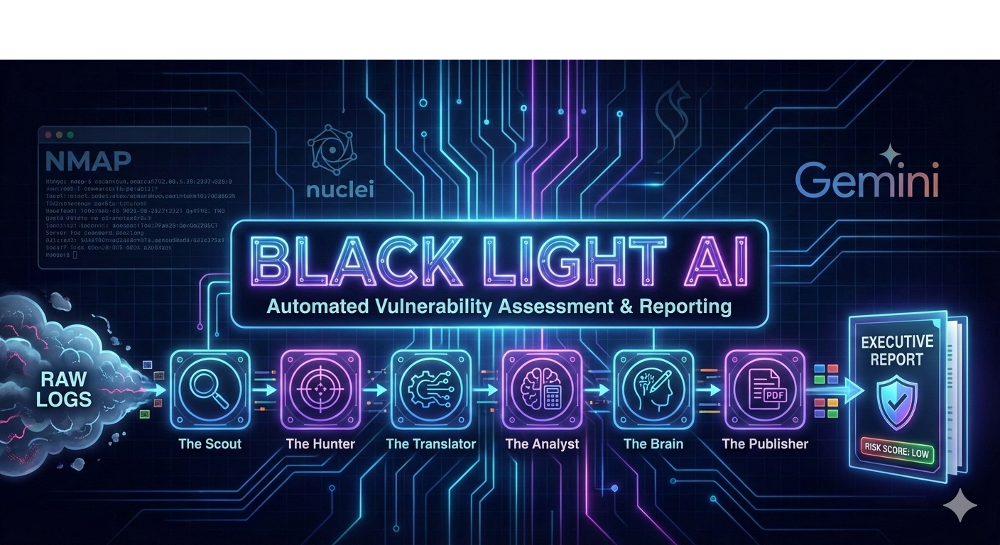
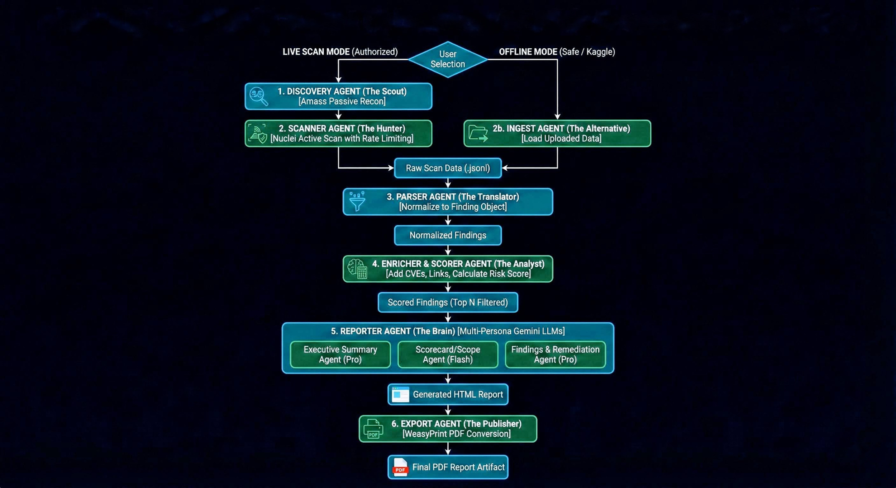

# Black Light AI: Autonomous Cyber Threat & Risk Intelligence



Black Light AI is an autonomous, multi‑agent cybersecurity assistant that automates the full lifecycle of web application vulnerability assessment – from reconnaissance and scanning to risk scoring and executive‑grade reporting.

Originally developed as part of the **5‑Day AI Agents Intensive with Google** by **Team TRIPOD (Vishwas Kura, Anirban, Mehak Aeora)**, this project demonstrates how classic offensive security tooling (Nuclei, Amass) can be orchestrated with Gemini‑powered agents to produce production‑ready security reports.

---

## 💡 Why Black Light AI?

Traditional vulnerability assessment has a **signal‑to‑noise problem**. Running tools like Nmap, Nuclei and Amass often leaves you with a huge, fragmented JSON log that still needs hours of manual triage before you can tell what actually matters.

Black Light AI was built to fix three recurring bottlenecks:

1. **Information overload** – Great tools, too much output. Thousands of findings with no clear prioritization.
2. **Missing business context** – A scanner sees open ports; a human sees revenue, data and reputation at risk. Most automated tools don’t reason about business impact.
3. **Reporting fatigue** – Turning raw tool output into an executive‑friendly BLUF report is slow, repetitive work that analysts hate.

Black Light AI acts as a **virtual security analyst**: it ingests noisy scan data, reasons about risk, and produces decision‑grade reports for both engineers and executives.

---

## ✨ Key Features

- **End‑to‑end vulnerability pipeline** – discovery → scan → parse → enrich → report → PDF export.
- **Multi‑agent architecture** with specialized roles (Scout, Hunter, Translator, Analyst, Writer).
- **Dual operation modes**:
  - **Live Scan** against authorized targets (Nuclei + Amass).
  - **Offline / Safe Mode** using pre‑generated JSON/JSONL scan data.
- **Logic‑based risk scoring** combining severity, CVE presence, and confidence.
- **CVE enrichment** with automatic NVD links for each identified CVE.
- **Multi‑persona Gemini reporting** – Executive summary, technical findings, remediation guidance.
- **Professional HTML & PDF report generation** using a custom 3‑page template and WeasyPrint.

---

## 🧱 Architecture Overview

Black Light AI is implemented as a **multi‑agent pipeline** rather than a single, monolithic LLM prompt. This keeps each step focused, reduces context size, and improves accuracy when working with large scan logs.



All logic lives in the notebook **`BlackLightAI.ipynb`**, which implements a sequential multi‑agent pipeline:

1. **Environment Setup (master cell)**
   - Installs system dependencies: Nmap, Go, Nuclei, Amass, WeasyPrint deps.
   - Installs Python libs: `google-adk`, `google-generativeai`, `xmltodict`, `weasyprint`.

2. **Configuration & Auth**
   - Pulls `GOOGLE_API_KEY` from Kaggle Secrets (or environment variable locally).
   - Defines core settings in the config cell:
     - `RUN_LIVE_SCAN`
     - `TARGET_DOMAIN`
     - `SAFE_MODE`
     - `OUTPUT_DIR`
     - `NUCLEI_TEMPLATES_DIR`, `NUCLEI_RATE_LIMIT`
     - `RAW_DIR` (offline input directory)
     - `TOP_N_FOR_REPORT`

3. **Agents**

   **Discovery Agent – "The Scout"** (`discovery_agent`)
   - Uses **Amass** in passive mode to enumerate subdomains for `TARGET_DOMAIN`.
   - Saves discovered assets to `artifacts/assets.txt`.

   **Scanner Agent – "The Hunter"** (`scanner_agent`)
   - Uses **Nuclei** to run safe, rate‑limited scans against the discovered assets.
   - Applies a curated set of templates.
   - Scrubs `GOOGLE_API_KEY` from the environment before invoking Nuclei.
   - Outputs raw scan results to `artifacts/scan.jsonl`.

   **Offline Ingest Agent – "The Alternative"** (`offline_ingest_agent`)
   - Used when `RUN_LIVE_SCAN = False`.
   - Walks `RAW_DIR` and merges all `.jsonl` and `.json` files into `artifacts/scan.jsonl`.
   - Designed for safe use on Kaggle with synthetic or pre‑generated scan data.

   **Parser Agent – "The Translator"** (`parser_agent`)
   - Normalizes raw Nuclei output into a common **`Finding`** dataclass:
     - `title`, `severity`, `host`, `evidence`, `template_id`, `timestamp`
     - `cve_ids`, `cve_links`, `cvss`, `confidence`, `risk_score`, `notes`
   - Writes structured findings to `artifacts/findings.json`.

   **Enricher & Scorer Agent – "The Analyst"** (`enrich_and_score_agent`)
   - Extracts CVE identifiers with regex (e.g. `CVE‑2023‑12345`).
   - Builds NVD links for each CVE.
   - Computes a numeric `risk_score` based on severity, CVE presence, and confidence.
   - Saves enriched findings to `artifacts/findings_scored.json`.

   **Reporter Agent – "The Writer"** (`reporter_agent`)
   - Uses **Gemini** via a thin `GeminiClient` wrapper.
   - Runs multiple logical “roles” over the data:
     - ExecutiveSummaryAgent – exec‑level summary & business impact.
     - ScorecardScopeAgent – scorecard table, scope, and methodology.
     - FindingsWriterAgent – detailed top‑N technical findings.
     - RemediationAgent – per‑finding fixes, best practices, and conclusion.
   - Injects model (or deterministic fallback) output into a rich HTML template (`HTML_TEMPLATE`).
   - Writes `artifacts/report.html`.

   **Export Agent – PDF** (`export_pdf`)
   - Converts `report.html` into `artifacts/report.pdf` using WeasyPrint (if available).

   **Orchestrator** (`main`)
   - Ties everything together:
     1. `ensure_environment()`
     2. Either `discovery_agent()` + `scanner_agent()` **or** `offline_ingest_agent()`
     3. `parser_agent()`
     4. `enrich_and_score_agent()`
     5. `reporter_agent()`
     6. `export_pdf()`
   - Prints `✅ Pipeline complete. Artifacts in: artifacts` when done.

---

## ⚙️ Configuration

Key configuration happens in the **Configuration & Usage Guide** cell of the notebook:

```python
RUN_LIVE_SCAN = False   # False = offline/safe mode, True = live scan
TARGET_DOMAIN = "demo.testfire.net"   # Only used when RUN_LIVE_SCAN is True
SAFE_MODE = True
OUTPUT_DIR = "artifacts"

NUCLEI_TEMPLATES_DIR = "/root/nuclei-templates"
NUCLEI_RATE_LIMIT = 50
TOP_N_FOR_REPORT = 5

RAW_DIR = "/kaggle/input/nuclei-scans"  # Offline input folder when RUN_LIVE_SCAN=False
```

### Modes

- **Offline / Safe Mode (recommended default)**
  - `RUN_LIVE_SCAN = False`
  - The pipeline reads existing scan JSON/JSONL files from `RAW_DIR`.
  - Fully compatible with Kaggle’s AUP when used with synthetic / pre‑approved data.

- **Live Scan Mode (authorized targets only)**
  - `RUN_LIVE_SCAN = True`
  - `TARGET_DOMAIN` must be a domain you own or are explicitly allowed to test.
  - Uses Amass + Nuclei with rate limiting and a minimal template set.

---

## 📥 Inputs & 📤 Outputs

**Inputs**

- **Offline Mode**: one or more Nuclei/Nmap outputs in `.json` or `.jsonl` under `RAW_DIR`.
- **Live Mode**: `TARGET_DOMAIN` plus network access and installed tools (Amass, Nuclei).

**Generated outputs (under `artifacts/`)**

- `scan.jsonl` – merged raw scanner output.
- `findings.json` – normalized findings.
- `findings_scored.json` – enriched + risk‑scored findings.
- `report.html` – full 3‑page HTML security report.
- `report.pdf` – printable PDF report (if WeasyPrint is available).

---

## 🧰 Requirements

Because this is notebook‑first, the easiest way to run Black Light AI is on **Kaggle** or a similar Linux environment.

### System tools

Installed via the initial setup cell:

- `nmap`
- Go 1.23+
- `nuclei` (latest)
- `amass` (master)
- WeasyPrint system deps (`libcairo2`, `libpango-1.0-0`, `libpangocairo-1.0-0`, `libgdk-pixbuf2.0-0`, `libffi-dev`, `libjpeg-dev`, `libxml2-dev`, `libxslt1-dev`, `zlib1g-dev`)

### Python

- Python 3.10+
- Packages (installed in the setup cell):
  - `google-adk`
  - `google-generativeai`
  - `xmltodict`
  - `weasyprint`

### Gemini API key

- Environment variable **`GOOGLE_API_KEY`** must be set, or
- On Kaggle, add a secret named `GOOGLE_API_KEY` and the notebook will read it via `UserSecretsClient`.

---

## 🚀 Quick Start (Kaggle‑Style Workflow)

1. Upload or import `BlackLightAI.ipynb` into Kaggle.
2. Add your scan data as a Kaggle dataset (or use the default sample), and note its path.
3. In **Kaggle → Settings → Secrets**, create a secret named `GOOGLE_API_KEY` with your Gemini key.
4. In the configuration cell, set:
   - `RUN_LIVE_SCAN = False`
   - `RAW_DIR = "/kaggle/input/<your-dataset-name>"`
5. Run all cells top‑to‑bottom.
6. Download the generated artifacts from the `artifacts/` directory (`report.html` and `report.pdf`).

---

## 🖥️ Running Locally (Linux)

1. Clone this repository and navigate into `BlackLightAI`:

   ```bash
   cd BlackLightAI
   ```

2. Open `BlackLightAI.ipynb` with Jupyter, VS Code, or another notebook environment.
3. Run the **environment setup** cell to install Go, Nuclei, Amass, and Python deps.
4. Export your Gemini key:

   ```bash
   export GOOGLE_API_KEY="<your-gemini-api-key>"
   ```

5. Adjust the configuration cell:
   - For **offline mode**, point `RAW_DIR` to a local folder containing Nuclei/Nmap `.json`/`.jsonl` files.
   - For **live scans**, set `RUN_LIVE_SCAN = True` and update `TARGET_DOMAIN` to an authorized target.

6. Run the `main()` cell (or run all cells). When finished, open `artifacts/report.html` or `artifacts/report.pdf`.

---

## 🔐 Security, Ethics & Kaggle AUP

This project wraps **offensive security tools** (Nuclei, Amass, Nmap). Misuse can be illegal and may violate platform policies.

- **Never scan systems you do not own or have explicit written permission to test.**
- On Kaggle, keep `RUN_LIVE_SCAN = False` and work only with offline scan data to avoid AUP violations.
- Use dedicated lab / sandbox environments for any live testing.
- All responsibility for how you run this code lies with **you** as the operator.

---

## 🧠 Why Multi‑Agent Instead of One Big LLM?

Scan outputs can easily reach **thousands of lines of JSON**. Passing all of that into one giant prompt causes context bloat and degraded reasoning.

Black Light AI instead:

- **Normalizes and filters** data into a compact `Finding` structure.
- **Prioritizes** the **Top‑N** highest‑risk findings (`TOP_N_FOR_REPORT`).
- Sends only **focused, structured context** into each reporting sub‑agent (executive summary, scorecard, remediation, etc.).

This design keeps the LLM focused and significantly reduces hallucinations compared to dumping raw logs into one prompt.

---

## 🧪 Challenges & Key Learnings

Building offensive‑security agents in cloud notebooks (e.g., Kaggle) raises both **technical constraints** and **ethics/safety** concerns.

1. **Sandboxed environments & network limits**  
   Tools like Nmap and Nuclei often require raw sockets, higher privileges, or unrestricted outbound traffic. Notebook platforms restrict this.

   In this notebook implementation, security tools are invoked via `subprocess` where allowed, and an **offline ingest mode** (`offline_ingest_agent`) is provided so the reasoning and reporting pipeline can still run purely on uploaded scan data.

   In a more advanced, cloud‑native deployment, the same agent logic can orchestrate **containerized scanners** (e.g., on Cloud Run or other services) via HTTP APIs instead of local shell access.

2. **Runaway bot risk (Human‑in‑the‑loop)**  
   Any autonomous system that can decide what to scan must guard against targeting unauthorized systems. The recommended pattern is to keep a **human approval step** in front of any active scan, especially in live/production environments.

3. **Controlling hallucinations via context compaction**  
   Early versions of the pipeline could over‑interpret empty scan results. The final design routes only **validated `Finding` objects** into the LLMs and uses deterministic, math‑based risk scoring. That way, if there are no real findings, the report clearly says so instead of inventing issues.

---

## ✅ Benefits

- **10× faster** than manual triage of raw scanner output.
- **Deterministic, logic‑based risk scores** instead of opaque LLM guesses.
- **Decision‑grade reports** that executives will actually read.
- Works **online (live scan)** or **offline (synthetic / pre‑generated data)**.
- **Low hallucination risk** thanks to strict normalization and scoring before LLMs see the data.

---

## 🗺️ Future Roadmap

Planned and aspirational extensions for Black Light AI include:

- **Real‑time dashboards** – Move from static PDFs to a live web UI (e.g., React + API backend).
- **Threat intel integration** – Pull EPSS / threat‑feed data to prioritize vulnerabilities that are actively exploited in the wild.
- **Ticketing integration** – Have the Remediation logic automatically open issues in Jira / GitHub / GitLab for engineering teams.

---

## 🔗 Project Links

Add your public resources here once available:

- **YouTube overview:** [_Link](https://www.youtube.com/watch?v=GmU_dUrl0q8)
- **Kaggle notebook:**  [_Link_](https://www.kaggle.com/code/codenameanirban/black-light-ai)
- **Medium article:**  [_Link_](https://medium.com/@anirbanhalderhp/black-light-ai-autonomous-cyber-threat-risk-intelligence-4f5d03faa1d6)

---

## 📂 Project Structure

- `BlackLightAI.ipynb` – main notebook containing all agents and pipeline code.
- `Blacklightbanner.png` – cover image used in this README.
- `artifacts/` – generated at runtime with normalized findings and final reports.

---

## 👥 Credits

**Team TRIPOD – @TriPod**

- Anirban Halder
- Vishwas Kura
- Mehak Aeora

Built during the **5‑Day AI Agents Intensive with Google**, November 2025.

---

## 📜 License

No license has been specified yet. Add a `LICENSE` file (e.g., MIT or Apache‑2.0) before using this project in production or redistributing it.
